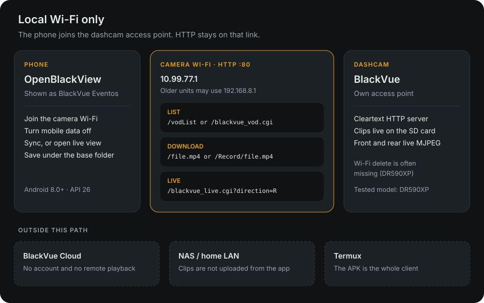
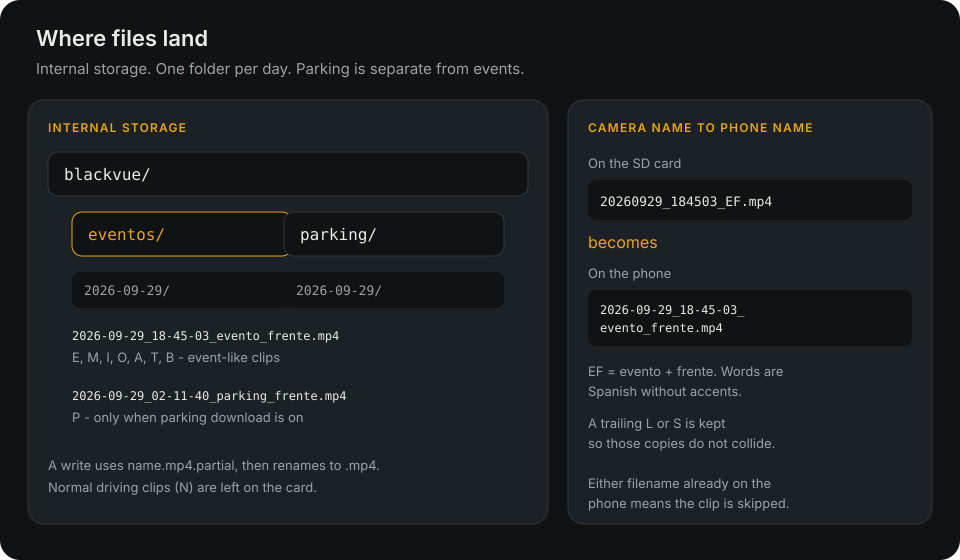
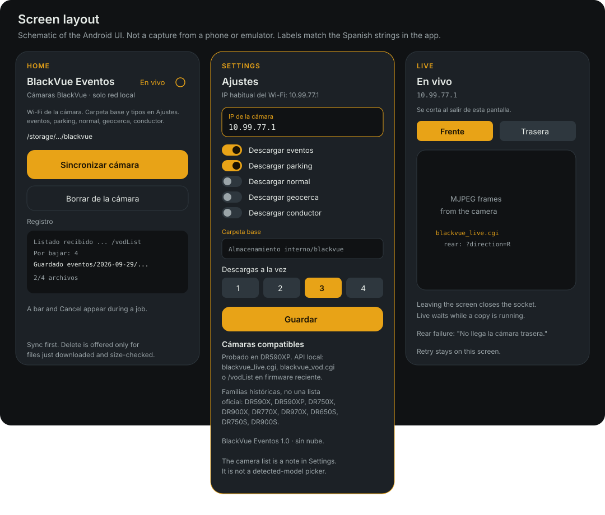

# OpenBlackView

Android app that copies event clips, and optional parking clips, from a BlackVue dashcam over the camera’s own Wi‑Fi, and shows front or rear live view. On the phone the app is named **BlackVue Eventos**.

[](LICENSE)


The phone joins the dashcam access point and talks to it over cleartext HTTP. Clips stay on the phone. There is no account and no analytics. MIT licensed.

The in-app language is Spanish. This file is the English guide.

## What it is

OpenBlackView is a single APK. It lists recordings on the camera, downloads the event-like ones (and parking, when that option is on), and can open a live MJPEG stream from the front or rear lens.

| Topic | Detail |
| --- | --- |
| Network | Camera Wi‑Fi only. Default host `10.99.77.1` |
| Sync | Event clips, plus parking when enabled |
| Live view | Front and rear |
| Storage | `blackvue/eventos` and `blackvue/parking` on the phone |

BlackVue Cloud is not required. Copying files onward to a NAS is out of scope: any app that syncs a folder can do that later. Termux, Python, and helper scripts are not part of the install.

## Diagrams

These figures describe the current app. They are diagrams, not photos from a phone or emulator. Device screenshots can replace the screen layout later.







## Features

- Lists the card over the camera’s local HTTP API and skips a clip that is already stored, whether under the original camera name or the readable local name.
- Downloads event-like types `E`, `M`, `I`, `O`, `A`, `T`, `B`: event, manual, impact, overspeed, acceleration, cornering, braking. That is the same set as [blackvuesync](https://github.com/acolomba/blackvuesync) `--include E,M,I,O,A,T,B`.
- Parking (`P`) is a separate option, on by default, and goes to its own folder.
- Leaves normal driving recordings (`N`) on the card.
- Downloads 1–4 files at once (default 3). If the camera fails under that load, the rest of the queue continues one file at a time.
- Writes each file as `.partial` and renames it to `.mp4` only after the write finishes.
- Stops when free space drops below 200 MB.
- After a sync, can ask the camera to delete only the files from that run that downloaded completely and match in size. The dialog asks for confirmation. The rest of the card is left alone.
- Live view uses `http://<host>/blackvue_live.cgi`. Rear adds `?direction=R`. Leaving the screen closes the socket. Live waits while a copy is running.
- Shows a foreground notification for the duration of a copy or delete, so the job can continue with the screen off.
- Stores the camera IP, the parking switch, and the parallel-download count on the phone.

## Compatible cameras

**Tested with this app:** BlackVue DR590XP, with the phone on the camera’s own Wi‑Fi.

**Same local HTTP API, not verified in this repository:** other BlackVue models that serve one of these two list/download shapes. The app probes both.

| Firmware | List | File URL |
| --- | --- | --- |
| V1.009 and later, when `GET /accessible` returns HTTP 200 and `GET /vodList` returns a JSON file list | `/vodList` | `/<filename>` |
| Older firmware, including DR590X-class units before that split | `GET /blackvue_vod.cgi` (plain text) | `/Record/<filename>` |

Live view needs `blackvue_live.cgi`. If the rear query returns no frames, the app says the rear camera is unavailable (`No llega la cámara trasera.`).

Families that have historically used those endpoints in the official app, in [blackvuesync](https://github.com/acolomba/blackvuesync), and in other community tools. This is not an official catalogue, and it is not a claim that each model was tested here:

- DR590X, DR590X-2CH, and DR590XP
- DR750X, DR900X, DR770X, and DR970X, including Plus and LTE variants, with the phone joined to the camera Wi‑Fi (LTE does not change that)
- Earlier series with the same listing: DR650S, DR750S, and DR900S

The same note is on the **Ajustes** screen. It is a written note, not a control that detects the model.

The default host `10.99.77.1` is the usual address of the camera access point on current firmware. Some older units use `192.168.8.1`. Either way it is the dashcam’s address, not a host on a home router. Settings keeps the last IP you saved.

Wi‑Fi delete is absent on many models, including the tested DR590XP. Some 2025 DR770X and DR970X firmware may answer a delete call. The app tries a file-scoped request and then lists the card again. A file counts as removed only when that fresh index no longer contains the name. Otherwise it stays on the SD card.

## How it works

1. Connect the phone to the **camera Wi‑Fi** and turn mobile data off, so HTTP reaches the dashcam.
2. Open settings and check the **camera IP**.
3. Grant storage access, then tap **Sincronizar cámara** or **En vivo**.

If the camera does not answer, the log shows: «No se alcanza la cámara. Conéctate a su Wi‑Fi e inténtalo.» A missing Wi‑Fi connection is also logged as a warning before the attempt.

Each accepted clip is `YYYYMMDD_HHMMSS_` plus a type letter, a direction letter, an optional `L` or `S`, and `.mp4`. Anything else is ignored.

```text
Internal storage/blackvue/eventos/YYYY-MM-DD/*.mp4
Internal storage/blackvue/parking/YYYY-MM-DD/*.mp4
```

Example: `blackvue/eventos/2026-09-29/2026-09-29_18-45-03_evento_frente.mp4`

The camera name `20260929_184503_EF.mp4` is stored with the date, time, type, and direction in Spanish, without accents. A trailing `L` or `S` is kept (`_L` or `_S`) so those variants do not overwrite each other. If the phone already has the file under the camera name or the local name, it is not downloaded again.

| Type | Word in the filename | Folder |
| --- | --- | --- |
| `E` | evento | eventos |
| `M` | manual | eventos |
| `I` | impacto | eventos |
| `O` | exceso | eventos |
| `A` | aceleracion | eventos |
| `T` | curva | eventos |
| `B` | frenada | eventos |
| `P` | parking | parking |
| `N` | — | not downloaded |

| Direction | Word in the filename |
| --- | --- |
| `F` | frente |
| `R` | trasera |
| `I` | interior |
| `O` | opcional |

## Requirements

- Phone: Android 8.0 or newer (`minSdk` 26). `compileSdk` and `targetSdk` are 35.
- To build: JDK 17 and Android SDK 35.
- A dashcam in Wi‑Fi access-point mode, and the phone associated with that network.

## Build & install

```sh
./gradlew assembleDebug
```

The APK is `app/build/outputs/apk/debug/app-debug.apk`. Install it with adb, or copy it to the phone and open it. If Android blocks unknown sources, allow installs from the file manager.

```sh
adb install -r app/build/outputs/apk/debug/app-debug.apk
```

Unit tests cover naming, listing, and the live URL. They do not need a phone or a camera:

```sh
./gradlew testDebugUnitTest
```

There is no dependency-install button. The debug APK is the client.

## Permissions

| Android | Storage |
| --- | --- |
| 8.0–9 | Storage permission, so the app can write `Internal storage/blackvue` |
| 10 | System folder picker. Choose the `blackvue` folder |
| 11 and newer | All-files access for that same path, because it sits outside Photos. The folder picker is also offered if all-files access is not granted |
| 13 and newer | Notification permission, so the copy can keep running with the screen off |

On every version the app also uses:

- Internet, plus network and Wi‑Fi state, to reach the camera and to notice when Wi‑Fi is down.
- Cleartext HTTP. The dashcam serves `http://`, not TLS. See `app/src/main/res/xml/network_security_config.xml`.
- A data-sync foreground service and a wake lock while a copy or delete is running.

## Limitations

- Normal recordings (`N`) are not downloaded.
- Files are not uploaded to a NAS, SMB share, or WebDAV server.
- BlackVue Cloud, accounts, and remote playback are not used.
- There is no Termux or script bootstrap.
- Delete over Wi‑Fi does nothing on many cameras (the DR590XP among them). The log says so, and the file remains on the card. Some recent DR770X and DR970X firmware may accept the delete.
- Delete is limited to files from the current sync that finished and whose size matches the download. It does not format the card or delete by wildcard.
- Live view is a live MJPEG display. It does not record, and it closes when you leave the screen.
- Live view waits until an in-progress copy finishes.
- Clip names that do not match `YYYYMMDD_HHMMSS_TD.mp4`, with an optional `L` or `S`, are skipped.
- Downloads stop when free space is under 200 MB.
- The interface is Spanish.

## Contributing

Issues and pull requests are welcome. Keep the client on the camera Wi‑Fi: list, download, live view, and the storage layout above. NAS sync and Cloud login are out of scope on purpose.

For a change that touches naming, the file index, or the live URL:

```sh
./gradlew testDebugUnitTest
```

UI strings in the app stay in Spanish unless a change is explicitly about translation.

## License

MIT. See [LICENSE](LICENSE). Copyright 2026 OpenBlackView contributors.

## Español

App Android para copiar clips de evento y, si lo activas, de parking desde el Wi‑Fi de la propia BlackVue, y ver el directo de frente o trasera. En el teléfono se llama **BlackVue Eventos**. Probada en la DR590XP; otras familias con la misma API HTTP local pueden funcionar (la nota está en Ajustes). No hace falta BlackVue Cloud ni Termux. Los vídeos se quedan en `blackvue/eventos` y `blackvue/parking`. Subirlos a un NAS queda fuera.
